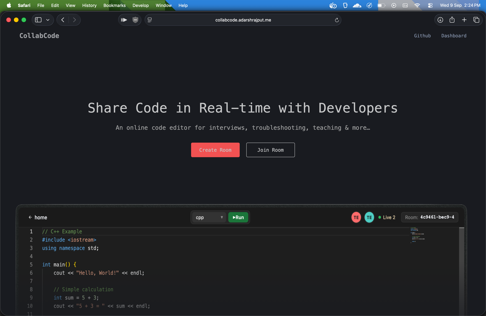

<div align="center">

  
  
  
  
  
  
  
  
  

  <h1>collabCode</h1>
  <p>An online code editor for interviews, troubleshooting, teaching & more...</p>
</div>

---

## 🖼️ Preview
<!-- Hero Section Image Here: Replace the src below with your actual hero image -->
<div align="center">
  
</div>

---

## 🚀 What is collabCode?
**collabCode** is a robust real-time collaborative code editor that allows developers to write, share, and execute code simultaneously. Designed for technical interviews, pair programming, and remote teaching, it provides a seamless and responsive coding environment directly in the browser.

## ✨ Key Features & Functionality

### 🤝 Real-Time Collaboration
- **Simultaneous Editing:** Code together with peers in real-time. Changes made by one user are instantly reflected on all other users' screens via WebSockets.
- **Room Management:** Easily create new coding rooms and share the unique room URL/ID for others to join instantly.

### 💻 Advanced Code Editor
- **Syntax Highlighting & Auto-Completion:** Enjoy a professional coding experience with language-specific syntax highlighting, intelligent auto-complete, and familiar IDE shortcuts.
- **Multiple Languages:** Support for writing and running various programming languages.

### ⚙️ Integrated Code Execution (Console)
- **Run Code on the Fly:** Execute the code directly from the editor without switching windows. 
- **Real-Time Output:** The built-in console window dynamically captures and displays the compilation and execution output, including errors, in a terminal-like interface.

### 🔐 Secure Authentication & Dashboard
- **User Accounts:** Secure registration and login flows protected by JSON Web Tokens (JWT).
- **Personal Dashboard:** Logged-in users have access to a personal dashboard to manage and view their previously created coding rooms and sessions.

### ⚡ Blazing Fast Performance
- **Optimized Frontend:** Powered by Vite, React, and TypeScript for an incredibly fast and snappy user interface.
- **Scalable Backend:** Node.js, Express, and Redis handle WebSocket connections efficiently, ensuring smooth real-time syncing even with high traffic. 
- **Dockerized:** Easily deployable and scalable containerized architecture.

## 🛠️ Installation & Setup

1. **Clone the repository:**
   ```bash
   git clone https://github.com/adarshraj077/collabCode.git
   cd collabCode
   ```

2. **Start the backend:**
   ```bash
   cd backend
   npm install
   npm run dev
   ```

3. **Start the frontend:**
   ```bash
   cd frontend
   bun install
   bun run dev
   ```

---
*Built with ❤️ for developers.*